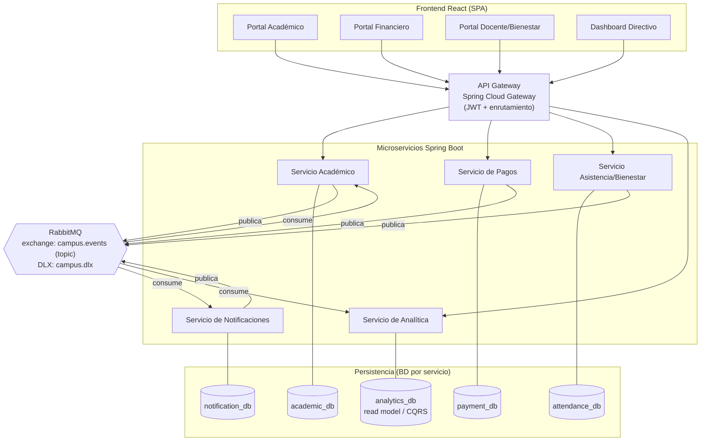
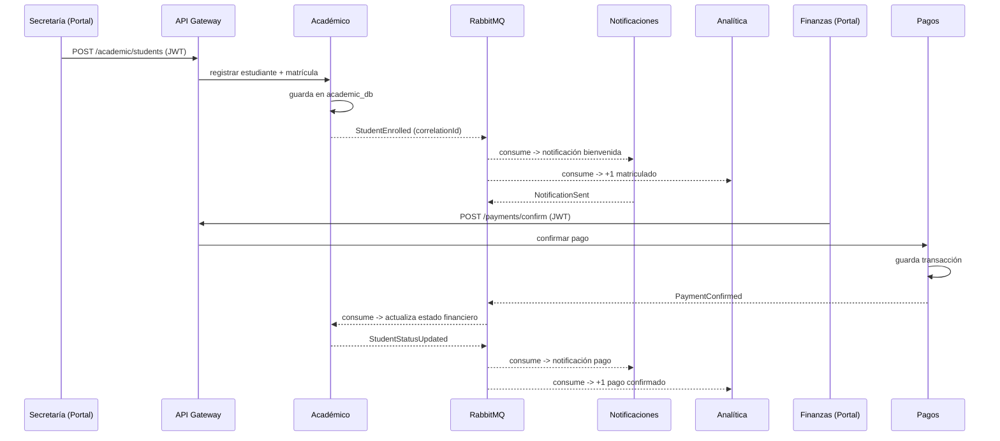

# Documento de Arquitectura — CampusConnect 360

> Paso 1 del plan · Diseño previo a la implementación
> Stack: **Spring Boot (Java)** · **RabbitMQ** · **React** (portales + dashboard propio) · **PostgreSQL** · **Docker Compose**

---

## 1. Descripción del problema

Una organización educativa administra una red de colegios en crecimiento. Hoy la información
de estudiantes, matrículas, pagos, asistencia, notificaciones y reportes vive en sistemas
distintos y desconectados: los pagos no se reflejan a tiempo en lo académico, las
notificaciones son manuales, la asistencia no se consolida y no hay trazabilidad ni una capa
estándar de APIs. **CampusConnect 360** integra estos sistemas mediante APIs, un API Gateway,
mensajería basada en eventos, integración de datos, seguridad, resiliencia y observabilidad.

## 2. Alcance de la solución

Se implementa un **ecosistema de microservicios** que simula la operación de un día normal:
matrícula de un estudiante, confirmación de un pago, registro de asistencia/incidente,
notificaciones automáticas y un dashboard directivo consolidado, con manejo explícito de
errores y trazabilidad de extremo a extremo.

## 3. Actores del ecosistema

| Actor | Rol | Portal |
|---|---|---|
| Secretaría Académica | Registra estudiantes y matrículas | Portal Académico |
| Finanzas | Confirma pagos, gestiona deudas | Portal Financiero |
| Docente / Bienestar | Registra asistencia e incidentes | Portal Docente |
| Dirección | Consulta indicadores consolidados | Dashboard Directivo |
| Sistema | Publica/consume eventos, notifica, traza | (automático) |

## 4. Diagrama de arquitectura

## 5. Servicios implementados

| Servicio | Responsabilidad única | Base de datos | Publica | Consume |
|---|---|---|---|---|
| **Académico** | Estudiantes, matrículas, estado académico/financiero | `academic_db` | `StudentEnrolled`, `StudentStatusUpdated` | `PaymentConfirmed` |
| **Pagos** | Deudas, transacciones, confirmación de pago | `payment_db` | `PaymentConfirmed` | — |
| **Asistencia/Bienestar** | Asistencia, ausencias, incidentes | `attendance_db` | `AttendanceRecorded`, `IncidentReported` | — |
| **Notificaciones** | Notificaciones simuladas a representantes | `notification_db` | `NotificationSent`, `NotificationFailed` | los 4 eventos de negocio |
| **Analítica** | Vista consolidada (read model) para el dashboard | `analytics_db` | — | todos los eventos |
| **API Gateway** | Entrada única, JWT, enrutamiento | — | — | — |

> Regla: cada servicio tiene responsabilidad clara y **su propia base de datos**. Ningún
> servicio accede directamente a la BD de otro; la integración es por API o por eventos.

## 6. Flujo de eventos (día de operación)

## 7. Decisiones arquitectónicas (ADR resumido)

| # | Decisión | Justificación | Alternativa descartada |
|---|---|---|---|
| 1 | Microservicios por dominio | Responsabilidades claras (requisito), despliegue y falla aislados | Monolito modular |
| 2 | RabbitMQ (topic exchange) | DLQ, reintentos e idempotencia simples de evidenciar; fan-out por routing key | Kafka (más pesado en Docker) |
| 3 | Spring Cloud Gateway | Integración nativa con Spring, filtros JWT y enrutamiento | Kong/NGINX |
| 4 | JWT en el gateway | Autenticación centralizada por rol antes de llegar a servicios | API Key simple |
| 5 | CQRS ligero en Analítica | `analytics_db` como read model alimentado por eventos → dashboard | Consultas cruzadas a otras BD |
| 6 | BD por servicio (PostgreSQL) | Aislamiento de datos, sin acoplamiento por esquema | BD compartida |
| 7 | Correlation ID en cada evento y log | Trazabilidad extremo a extremo | Sin correlación |

## 8. Seguridad

- Autenticación con **JWT** emitido al iniciar sesión; el **API Gateway valida el token** y
  propaga el usuario/rol a los servicios.
- Roles: `SECRETARIA`, `FINANZAS`, `DOCENTE`, `DIRECCION`. Cada portal exige su rol.
- Usuarios de prueba y variables sensibles vía `.env` (no se versionan secretos reales).

## 9. Resiliencia y manejo de errores

- **Dead Letter Channel**: exchange `campus.dlx` con una DLQ por consumidor.
- **Reintentos** con límite antes de enviar a DLQ.
- **Idempotent Receiver**: tabla `processed_events(eventId)` en Pagos/Académico para no
  reprocesar eventos críticos.
- **Estado de mensaje fallido** consultable; reprocesamiento manual desde panel/endpoint.
- Escenario de falla ensayado: *Notificaciones caído* → mensaje a DLQ → recuperación.

## 10. Observabilidad

- **Health checks** con Spring Boot Actuator (`/actuator/health`) por servicio.
- **Logs** estructurados con `correlationId` en el MDC para seguir un flujo completo.
- Panel de RabbitMQ como evidencia complementaria (colas, DLQ, mensajes).

## 11. Integración de datos y dashboard

El servicio de **Analítica** mantiene un **read model** (`analytics_db`) alimentado por los
eventos de negocio (proyección/CQRS). El **Dashboard Directivo** (React) consume la API de
Analítica y muestra: total matriculados, pagos confirmados/pendientes, asistencias,
incidentes, eventos procesados, errores/fallidos y estado general del ecosistema.

## 12. Limitaciones conocidas

- Notificaciones son **simuladas** (no se envía correo/SMS real).
- Sin alta disponibilidad ni réplicas; entorno de demostración en Docker Compose.
- Seguridad básica (JWT), sin OAuth2 completo ni gestión avanzada de secretos.

## 13. Mejoras futuras

- OAuth2/OpenID Connect e integración con proveedor de identidad.
- Orquestación con Kubernetes y escalado horizontal.
- Notificaciones reales (email/SMS/push) y plantillas.
- Observabilidad avanzada (Prometheus + Grafana, tracing distribuido).

## 14. Declaración de uso de IA

El uso de IA generativa (para andamiaje de código, formularios, documentación y diagramas) se
declara en la bitácora. El grupo comprende, adapta, integra y defiende todo el código
presentado.

---

**Ver también:** [Contratos de eventos](02-contratos-eventos.md) ·
[Contratos de API](03-contratos-api.md) · [Topología de mensajería](04-mensajeria-rabbitmq.md)
