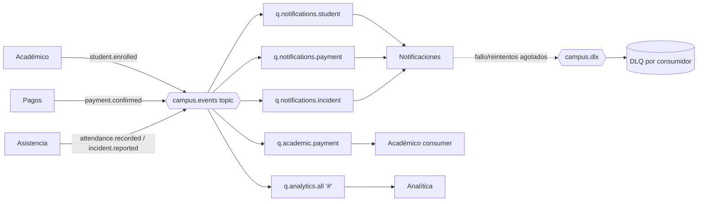

# Topología de Mensajería (RabbitMQ) y Patrones — CampusConnect 360

> Paso 1 · Diseño de canales, colas, routing keys y DLQ + mapeo a los patrones exigidos.

## 1. Exchanges

| Exchange | Tipo | Uso |
|---|---|---|
| `campus.events` | `topic` | Publicación de todos los eventos de negocio (Pub/Sub por routing key) |
| `campus.commands` | `direct` | Comandos punto-a-punto (ej. despacho de notificación) |
| `campus.dlx` | `topic` | Dead Letter Exchange: recibe mensajes fallidos/rechazados |

## 2. Routing keys

| Evento | Routing key |
|---|---|
| StudentEnrolled | `student.enrolled` |
| PaymentConfirmed | `payment.confirmed` |
| AttendanceRecorded | `attendance.recorded` |
| IncidentReported | `incident.reported` |
| NotificationSent | `notification.sent` |
| NotificationFailed | `notification.failed` |
| StudentStatusUpdated | `student.status.updated` |

## 3. Colas y bindings

Cada consumidor tiene su cola con `x-dead-letter-exchange = campus.dlx` y su DLQ asociada.

| Cola | Bind a `campus.events` (routing key) | Consumidor | DLQ |
|---|---|---|---|
| `q.notifications.student` | `student.enrolled` | Notificaciones | `dlq.notifications.student` |
| `q.notifications.payment` | `payment.confirmed` | Notificaciones | `dlq.notifications.payment` |
| `q.notifications.incident` | `incident.reported` | Notificaciones | `dlq.notifications.incident` |
| `q.academic.payment` | `payment.confirmed` | Académico (actualiza estado) | `dlq.academic.payment` |
| `q.analytics.all` | `#` (todos los eventos) | Analítica | `dlq.analytics.all` |

> El binding `#` en un exchange `topic` hace que Analítica reciba **todos** los eventos → base
> del read model (CQRS). `payment.confirmed` llega a la vez a Notificaciones, Académico y
> Analítica → evidencia de **Publish/Subscribe**.



## 4. Resiliencia

- **Reintentos**: política con `max-attempts` (ej. 3) e intervalo creciente antes de enrutar a DLQ.
- **Dead Letter Channel**: mensaje agotado → `campus.dlx` → `dlq.<consumidor>` (queda inspeccionable).
- **Idempotent Receiver**: tabla `processed_events(event_id PK, processed_at)`; si el `eventId`
  ya existe, el consumidor hace `ack` sin reprocesar. Obligatorio en `q.academic.payment`.
- **Reprocesamiento**: endpoint/panel para reenviar mensajes desde la DLQ al flujo normal.
- **Escenario de falla ensayado**: se apaga el servicio de Notificaciones → los mensajes se
  acumulan / van a DLQ → al reactivar, se reprocesan. Se explica en la defensa.

## 5. Mapeo patrón → evidencia (requisito sección 10 de la consigna)

| Patrón / concepto | Dónde se evidencia |
|---|---|
| **API Gateway** | Spring Cloud Gateway como entrada única con JWT |
| **Publish/Subscribe** | `payment.confirmed` consumido por Notificaciones + Académico + Analítica |
| **Point-to-Point** | `campus.commands` (direct): un comando lo procesa un único consumidor |
| **Message Channel** | Exchanges y colas nombradas explícitamente (este documento) |
| **Event Message** | Envelope de eventos con `eventId/eventType/occurredAt/correlationId` |
| **Message Translator** | Evento de dominio → modelo de lectura de Analítica / payload de notificación |
| **Idempotent Receiver** | `processed_events` en Pagos→Académico |
| **Dead Letter Channel** | `campus.dlx` + `dlq.*` por consumidor |
| **CQRS / vista analítica** | `analytics_db` (read model) alimenta el dashboard |
| **Health Check API** | `/actuator/health` por servicio |
| **Logs / trazabilidad** | `correlationId` propagado y registrado en cada salto |

## 6. Definición para el código (referencia Spring/RabbitMQ)

```yaml
# Convención de nombres (se implementará con @Bean Queue/Exchange/Binding o definitions.json)
exchanges:
  - { name: campus.events,   type: topic }
  - { name: campus.commands, type: direct }
  - { name: campus.dlx,      type: topic }
queues:
  - { name: q.analytics.all, bind: campus.events, key: "#", dlx: campus.dlx }
  - { name: q.academic.payment, bind: campus.events, key: "payment.confirmed", dlx: campus.dlx }
  - { name: q.notifications.student, bind: campus.events, key: "student.enrolled", dlx: campus.dlx }
  - { name: q.notifications.payment, bind: campus.events, key: "payment.confirmed", dlx: campus.dlx }
  - { name: q.notifications.incident, bind: campus.events, key: "incident.reported", dlx: campus.dlx }
```
